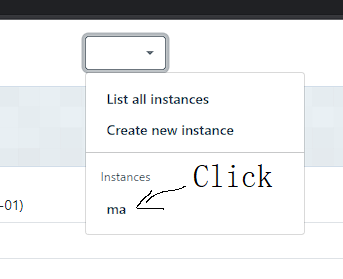
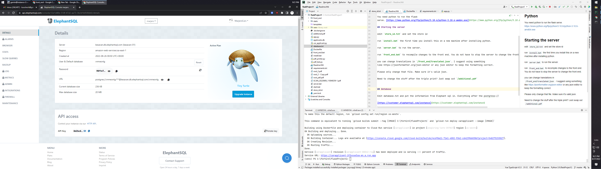
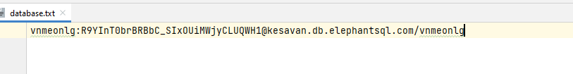

# Install

## NodeJS

You need nodejs to recompile the front
end [https://nodejs.org/dist/v16.17.0/node-v16.17.0-x64.msi](https://nodejs.org/dist/v16.17.0/node-v16.17.0-x64.msi)

## Python

You need python to run the flask
serve. [https://www.python.org/ftp/python/3.10.6/python-3.10.6-amd64.exe](https://www.python.org/ftp/python/3.10.6/python-3.10.6-amd64.exe)

## Starting the server

edit `store_id.txt` and set the store id

run `install.bat` the first time you install this on a new machine after installing python.

run `server.bat` to run the server.

run `front_end.bat` to recompile changes to the front end. You do not have to stop the server to change the front end.

you can change translations in `/front_end/translated.json`. I suggest using something
like https://jsonformatter.org/json-editor or any json editor to keep the formatting correct.

Please only change that file. Make sure it's valid json.

Need to change the stuff after the triple print? Just swap out `/additional.pdf`

## Database

Edit database.txt and put the information from Elephant sql in. Everything after the postgress:// 

[https://customer.elephantsql.com/instance](https://customer.elephantsql.com/instance)

 (this database has been deleted but am leaving this image for ref)

